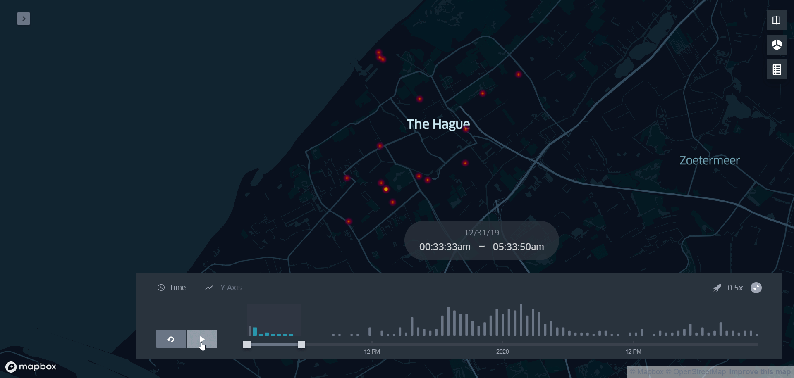
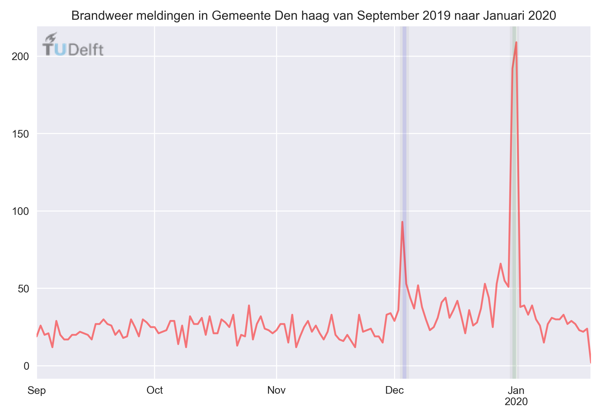
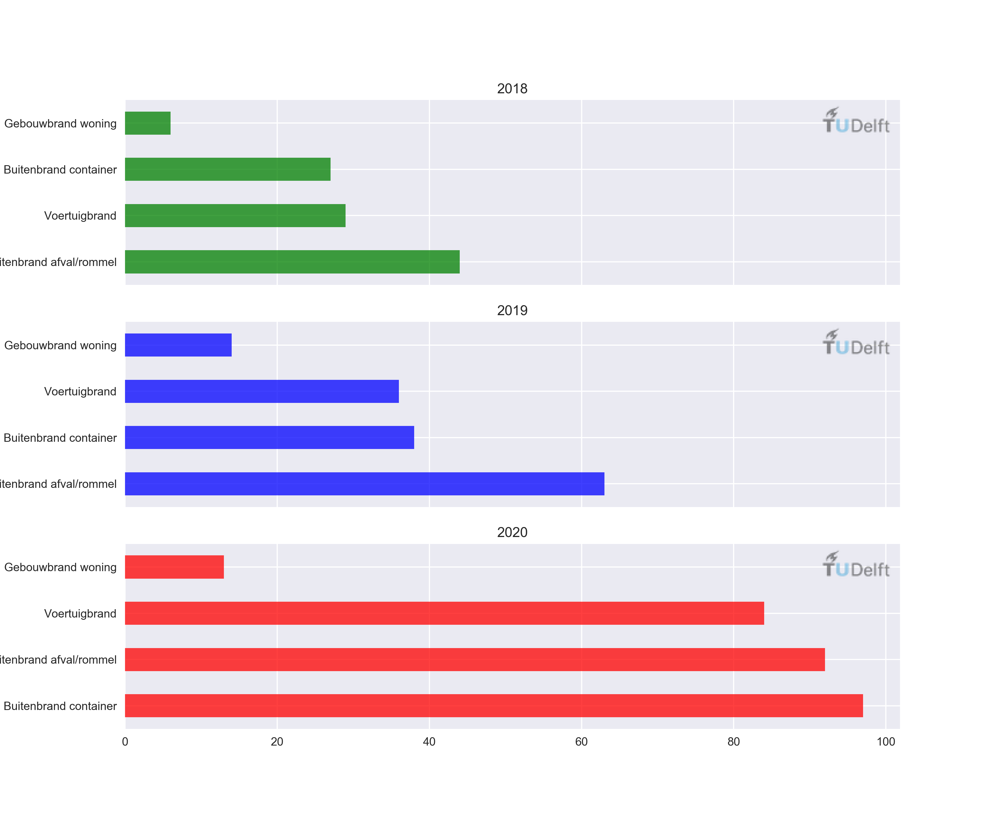

At present an active societal debate is going on in the Netherlands whether consumer fireworks should be banned. This debate follows from increasing violence directed at first aid responders, annually increasing arson and damage to public and private property. Out of curiosity and their interest in urban science and policy, TPM researchers Mikhail Sirenko, Trivik Verma, and Igor Nikolic decided to analyse the firefighter calls and support the debate with facts and figures.

**Arson incidents**
The initial idea to visualize the changes in firefighter calls over time around the New Year’s Eve window originated from Nikolic. While watching the news bulletins on New Year’s Eve and hearing about the arson and damages he decided to scrape and process data to map arson incidents in The Hague, Rotterdam and Amsterdam. He asked statistician Sirenko and computer scientist Verma from the Computational Urban Science and Policy Lab to join him in his efforts.

**Gathering data**
Sirenko was already familiar with scraping data: ‘Scraping is a computer technique where software is used to extract information from web pages. For my master’s thesis I used several open data sets such as the Dutch national emergency network P2000 to analyse the number of ambulance calls that were made during heatwaves in 2018 and 2019 in the Netherlands. This experience came in handy for this exercise in which I gathered data on firefighter calls from this network for the last three years.

**Analysis**
The analysed data shows a clear increase in firefighter calls leading up to the 31st of December in all three years, with a distinct peak around midnight, which then diminishes again after a few hours, as shown in this visualisation below. The data indicates the type of fire e.g. whether it is a house, a vehicle or a waste container that is on fire. It also shows that the number of reported fires increases yearly. ‘We also noticed that there is a bump in the peak of firefighter calls around 3rd December 2019, where residents started multiple fires in the Duindorp region of The Hague, which may be an indication of retaliation against the banning of the festive display of the bonfire at the beach in that year and increasing arson in the city,’ says Verma. These findings support the question to explore causal connections between arson, change in policy and fireworks.

Figure 1: Firefighter calls in The Hague from September 2019 up to January 2020.

Figure 2: Type and number of firefighter calls during New year's Eve in The Hague over 2018, 2019 and 2020.

**Clear connection**
On the basis of these data we can conclude that there is a clear link between increasing firefighter calls and New Year’s Eve. However, the data does not provide information about the cause of the arson, whether it is the fireworks or something else. This would need more rigorous, data-driven research. That being said, the researchers hope that their analysis can contribute to the ongoing debate on consumer fireworks. ‘Our data and code are open source and can be found online on [GitHub.com/mikhailsirenko/P2000](https://github.com/mikhailsirenko/P2000). You are invited to contribute additional data to shed more light on the analysis of firefighter calls and New Year’s Eve’, concludes Sirenko.

_Original article can be found [here](https://www.tudelft.nl/tbm/onderzoek/projecten/analysing-firefighter-calls-on-new-years-eve-with-open-source-data/)._
