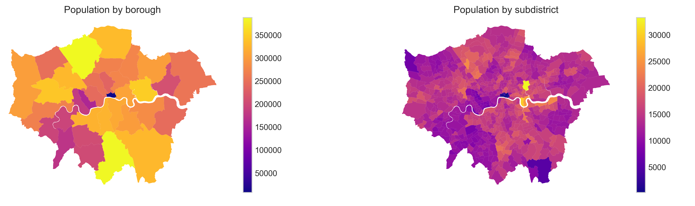
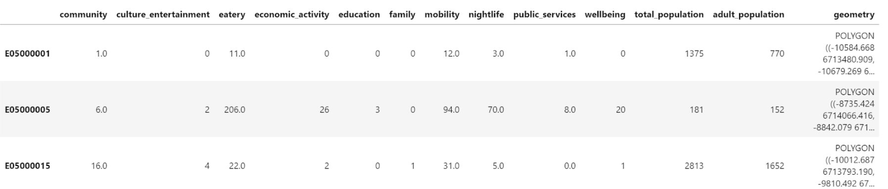
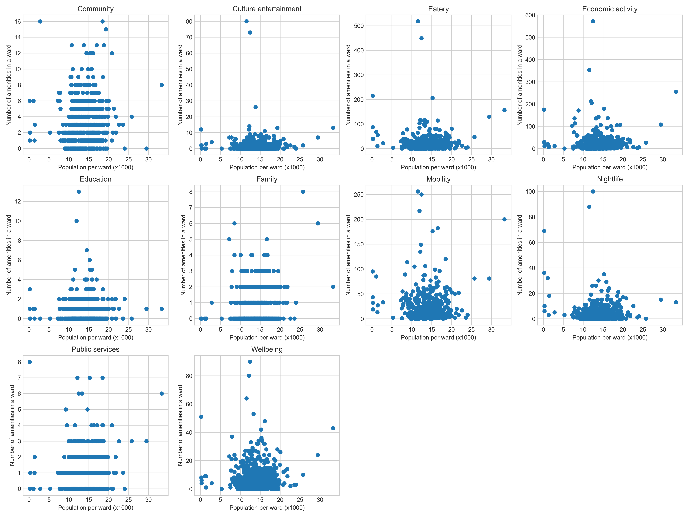
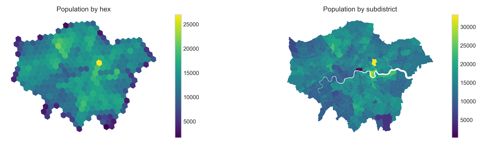
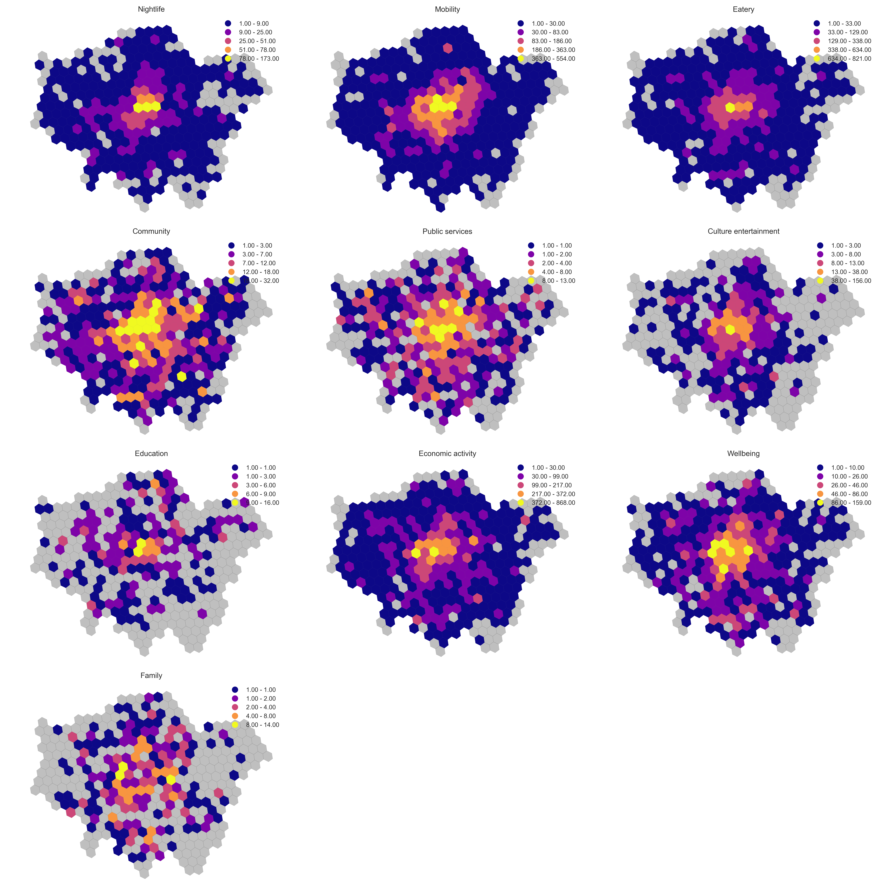
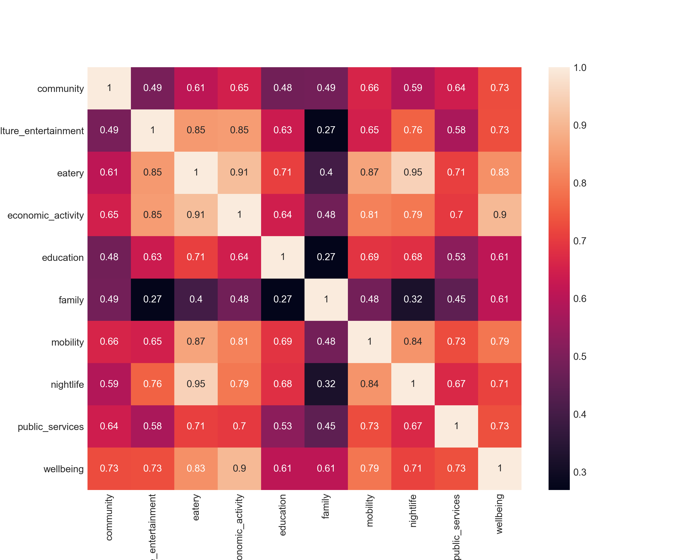
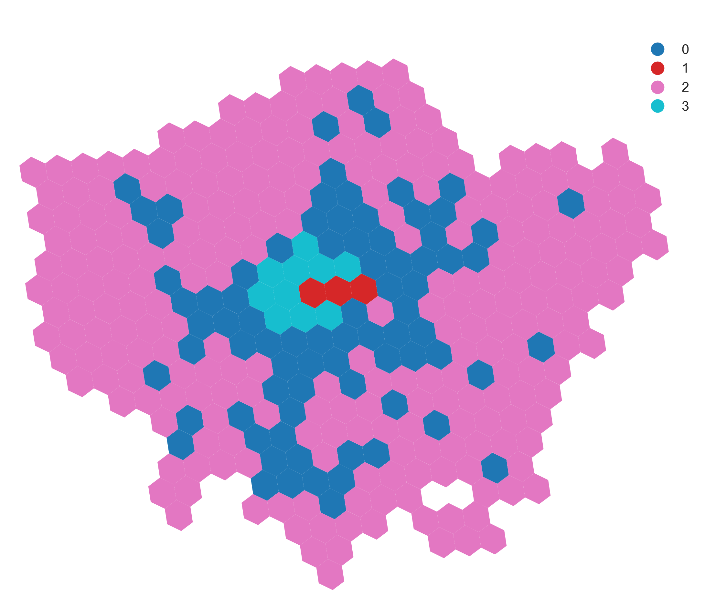
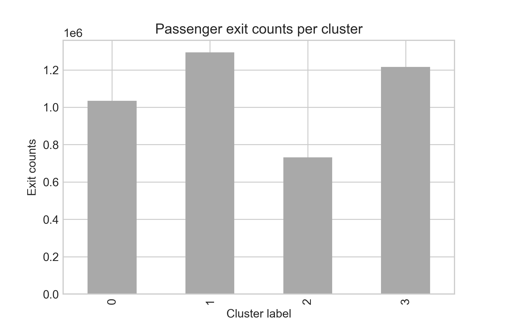

## Introduction

Many of us have experienced it: you wander about a city, and some streets are vibrant and abuzz with people and activity, while others are sleepy and deserted. What exactly is it that lends a place (or robs it of) its liveliness and candour? Dynamic neighbourhoods are often populated with well-patronized shops, restaurants and bars. These, as well as recreational public spaces - such as parks - and cultural attractions, are some examples of amenities that are known to attract large crowds to urban areas.

One may suspect that the answer to this question has something to do with urban amenities. Specifically, how are amenities distributed in urban spaces and how do specific amenities exert more drawing power than others? Furthermore, are there particular distributions of amenities that attract more people, and if so, how can city planners use this information to design and build better cities? Can this knowledge then be used to engineer the popularity (and relatedly, the economic and cultural importance) of a place?

To explore these questions, we took a closer look at the example of Greater London. The U.K. makes open a unique dataset for travel volume at each London Underground station, with daily averages for station entry and exit counts at 15-minute intervals. We also use data prepared by Geofabrik, which makes regularly updated OpenStreetMaps (OSM) data files available. The purpose of this work is to derive a pattern between urban amenities (OSM points-of-interests) and travel behaviour. Specifically, is there a relationship between the number and types of amenities at a location and the number of travellers going to that area?

If you are interested in reproducing results of this study or adapting it to your case, please take a look at my [GitHub repo](https://github.com/jwrap/how-london-moves).

## Data gathering and preprocessing

To start with, we obtained the following datasets:
[Greater London shapefile containing administrative boundaries](https://data.london.gov.uk/dataset/statistical-gis-boundary-files-london)
[Greater London population data](https://www.ons.gov.uk/peoplepopulationandcommunity/populationandmigration/populationestimates/datasets/censusoutputareaestimatesinthelondonregionofengland)
[London Underground passenger counts data](https://api-portal.tfl.gov.uk/docs)

The next step was to get points-of-interest (POIs) from OSM. There are various ways to download POIs, including with the [OSMnx](https://osmnx.readthedocs.io/en/stable/osmnx.html) library. However, we found that [pyrosm](https://pyrosm.readthedocs.io/en/latest/) provides a faster way to get this data as it leverages information already available on Geofabrik. Directly downloading the PBF file for Greater London and loading it with the Pyrosm library gives you a dataframe with all “amenity”-tagged POIs in Greater London on OSM.

With the datasets on hand, it is time to pre-process the data. Greater London is split into 33 boroughs (or districts), so looking at amenities and populations per district gives an aggregated view. The dataset further splits Greater London into ~630 subdistricts, which yields a higher resolution view.

_Population distribution, based on the 2017 census, by subdistrict and borough._

We first ran through the list of amenities and categorised the POIs into a (subjective) set of 9 broad categories, including “eatery”, “nightlife”, and “culture and entertainment”. The categorisation used in this analysis included a “miscellaneous” group, which includes POIs tagged as “disused” as well as those that do not clearly fall into the broadly defined categories (e.g., “grit box”). We dropped all amenities tagged “miscellaneous” before beginning the analysis, which removed approximately 30,000 POIs from the dataset. Further evaluation of the amenity categorisation may help in increasing the number of POIs used in the study. With the POIs preprocessed, we assigned the POIs and population numbers to boroughs and subdistricts using the Pandas library.

_First three rows of the processed GeoPandas dataset for amenities per subdistrict._

## Analysis

First, we took a look at whether there is a relationship between the number of amenities and the size of a population within an area. The instinct is that high population numbers come hand in hand with higher amenity density. Using Matplotlib, we generated a series of scatterplots for population vs number of amenities by subdistrict, for each amenity category. The scatterplots showed no distinct linear relationships between population size and the number of amenities.

_Scatterplots indicating the relationship between the number of amenities (by amenity type) and population per sub-district._

The scatterplots did reveal that many subdistricts contain very few (<5) or none of a specific amenity type (e.g., culture and entertainment, education).

Next, we plotted the distribution of amenities on a map of Greater London by subdistrict. The choropleths show that certain amenity types are concentrated in Central London (e.g., eatery, culture and entertainment), while others are more evenly distributed across the city (e.g., public services, wellbeing, community).

_Distribution of amenities by amenity type across Greater London. Some amenity types appear to be relatively evenly distributed across the metropolitan area, such as public services and wellbeing._

However, plotting amenity and population distribution by subdistrict boundary can be misleading because of a source of bias called the [modifiable areal unit problem](https://en.wikipedia.org/wiki/Modifiable_areal_unit_problem#:~:text=The%20modifiable%20areal%20unit%20problem%20(MAUP)%20is%20a%20source%20of,population%20density%20or%20illness%20rates.), which occurs when the same area can be represented differently via differing scales. Each subdistrict and borough have different shapes and sizes, which in turn determines the summary values (e.g., population or number of POIs per subdistrict /borough) used in the analysis. This bias is problematic, given that it is not particularly meaningful to state that the population of X is far greater than Y when the spatial size of X is far more extensive than Y anyway. Such a way of representing the data may distort the perception of spatial distribution patterns of amenity and population densities, thereby influencing the conclusions resulting from such a comparison. This issue is alluded to in the above maps of Greater London comparing population by borough and subdistrict.

For a more consistent and accurate distribution, we evaluated the population and amenity distribution with a hexagonal grid (hexgrid). To do this, we divided the Greater London area into same-size hexagons. Amenities that fall within a hexagon are counted towards that hexagon.

We assumed that the population is equally distributed across each subdistrict. In other words, each subdistrict has a set _population/area_. Thus, hexagons that fall entirely within a borough or subdistrict will be calculated by multiplying the _population/area_ with the _area of the hexagon_. Population in hexagons that fall across two subdistricts will be estimated based on the overlapping regions of the respective subdistricts and hexagons.

This method allows the grid size to be adjusted to more accurately represent the amenity and population distribution data while minimising the limitations associated with the modifiable areal unit problem. In doing so, we went from 73 subdistricts to 365 hexagons within the Greater London area.

_Comparison of population distribution with a hexgrid vs sub-district boundaries._

With the new distribution of amenities and population via the hexagonal grid, we regenerated the scatterplots, which still showed no discernible pattern between population size and the number of amenities.

_Distribution of amenities based on hexgrids show that certain amenity types, such as nightlife, are concentrated in Central London._

The hexgrid distribution does a better job than the choropleths of showing that certain amenity types are relatively concentrated within central London, and are distinctly less so in peripheral areas outside of Central London. Additionally, the hexgrid maps clearly show that some parts of London do not have specific amenities at all.

Another question we can now approach is whether it is likely to find specific pairs of amenities together in a region. Using Pandas and Seaborn, we plotted a Pearson correlation coefficient in the form of a heatmap for the amenity types. This showed a relationship between some amenity types, e.g. there is a high incidence of eatery, nightlife and economic activity amenities within the same subdistricts.

_A heatmap indicating correlations between amenity types. Eatery, nightlife and economic activity amenities are highly correlated._

To take the analysis a step further, we clustered the hexagons based on its distributions of amenities. We first used Scikit-learn’s StandardScaler to scale the amenity counts for each hexagon. This method has the effect of standardising the distributions for each amenity type such that it shifts the mean to zero and scales it to unit variance, and controls the impact of outliers among the amenity types.

Subsequently, we used K-means clustering to sort the hexagons based on the standardized amenity distributions into four separate clusters. Two of these clusters (labelled in the following plot as clusters ‘2’ and ‘3’) consist of a relatively few (14) hexagons which are located in Central London. A closer look reveals that these clusters generally have, on average, a higher amenity density (of all amenity types) than the remaining clusters. Culture and entertainment (e.g., theatres, art studios), eateries and nightlife amenities are also significantly better represented in these specific clusters.

_Distribution of hexagons, clustered based on the composition of amenity types. Clusters labelled 2 and 3 appear to be concentrated in Central London._

Finally, we obtained the total number of travellers (exit counts) at stations within those hexagons and compared this number against the number of amenities in each hexagon. We found that clusters 2 and 3 (in Central London) attract markedly higher passenger volumes (approximately 80%) than group 1 locations outside of Central London.

_Comparison of total passenger counts per cluster of hexagons. Cluster 1 shows markedly lower passenger volume than the remaining clusters_

## Conclusion

In this exercise, we explored the relationship between urban amenities and population in a city. We found that there does appear to be a specific distribution of amenities that are associated with a larger volume of traffic. Applying this framework to other cities and observing if similar behaviour (specific travel behaviour coinciding with specific distributions of amenities) emerges may serve to strengthen this finding.

Furthermore, the POIs dataset that forms the backbone of this analysis deserves further attention. As mentioned earlier, one can refine the sorting of amenities into broader categories to include more amenity types, as opposed to sorting into a hodgepodge category of “miscellaneous” amenities that we ultimately omit from the analysis.

Lastly, we suspect that basing the analysis on aggregate passenger volumes presents only one part of the picture. A more involved analysis, including the distribution of passenger volumes over times of the day, may provide a clearer picture and a more conclusive understanding of the relationship between travel behaviour and urban amenities.
